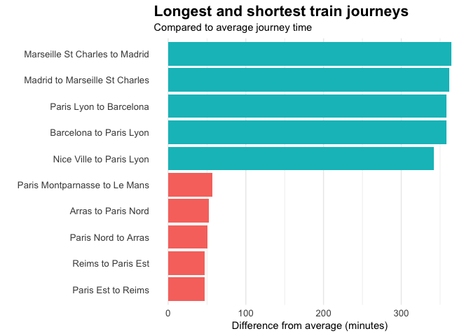
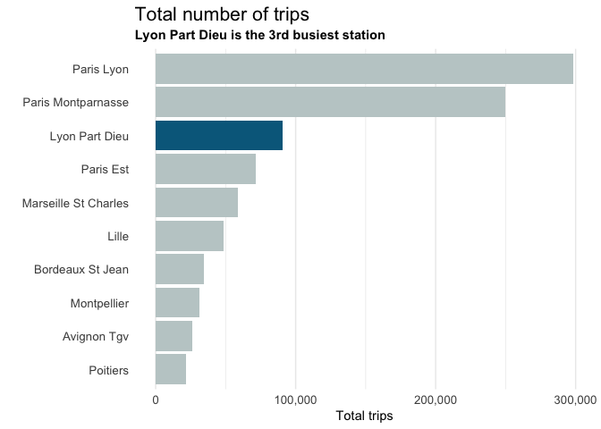
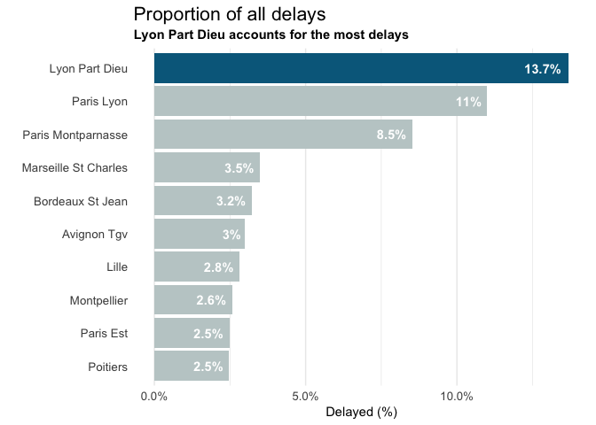

    library(tidyverse)

    ## ── Attaching packages ──────────────────────────────────────────────────────────────────────────────────────── tidyverse 1.2.1 ──

    ## ✔ ggplot2 3.1.0     ✔ purrr   0.3.0
    ## ✔ tibble  2.0.1     ✔ dplyr   0.7.8
    ## ✔ tidyr   0.8.2     ✔ stringr 1.3.1
    ## ✔ readr   1.3.1     ✔ forcats 0.3.0

    ## ── Conflicts ─────────────────────────────────────────────────────────────────────────────────────────── tidyverse_conflicts() ──
    ## ✖ dplyr::filter() masks stats::filter()
    ## ✖ dplyr::lag()    masks stats::lag()

    library(scales)

    ## 
    ## Attaching package: 'scales'

    ## The following object is masked from 'package:purrr':
    ## 
    ##     discard

    ## The following object is masked from 'package:readr':
    ## 
    ##     col_factor

    full_trains <- read_csv("https://raw.githubusercontent.com/rfordatascience/tidytuesday/master/data/2019/2019-02-26/full_trains.csv")

    ## Parsed with column specification:
    ## cols(
    ##   .default = col_double(),
    ##   service = col_character(),
    ##   departure_station = col_character(),
    ##   arrival_station = col_character(),
    ##   comment_cancellations = col_logical(),
    ##   comment_delays_at_departure = col_logical(),
    ##   comment_delays_on_arrival = col_character()
    ## )

    ## See spec(...) for full column specifications.

    small_trains <- read_csv("https://raw.githubusercontent.com/rfordatascience/tidytuesday/master/data/2019/2019-02-26/small_trains.csv")

    ## Parsed with column specification:
    ## cols(
    ##   year = col_double(),
    ##   month = col_double(),
    ##   service = col_character(),
    ##   departure_station = col_character(),
    ##   arrival_station = col_character(),
    ##   journey_time_avg = col_double(),
    ##   total_num_trips = col_double(),
    ##   avg_delay_all_departing = col_double(),
    ##   avg_delay_all_arriving = col_double(),
    ##   num_late_at_departure = col_double(),
    ##   num_arriving_late = col_double(),
    ##   delay_cause = col_character(),
    ##   delayed_number = col_double()
    ## )

    small_trains <- small_trains %>% 
      mutate(
        arrival_station = str_to_title(arrival_station),
        departure_station = str_to_title(departure_station)
      )

    full_trains <- full_trains %>% 
      mutate(
        arrival_station = str_to_title(arrival_station),
        departure_station = str_to_title(departure_station),
        date = as.Date(paste(year, month, 1, sep="/"))
      )

    str(full_trains)

    ## Classes 'tbl_df', 'tbl' and 'data.frame':    5462 obs. of  28 variables:
    ##  $ year                           : num  2017 2017 2017 2017 2017 ...
    ##  $ month                          : num  9 9 9 9 9 9 9 9 9 9 ...
    ##  $ service                        : chr  "National" "National" "National" "National" ...
    ##  $ departure_station              : chr  "Paris Est" "Reims" "Paris Est" "Paris Lyon" ...
    ##  $ arrival_station                : chr  "Metz" "Paris Est" "Strasbourg" "Avignon Tgv" ...
    ##  $ journey_time_avg               : num  85.1 47.1 116.2 161.1 164.5 ...
    ##  $ total_num_trips                : num  299 218 333 481 190 191 208 216 661 201 ...
    ##  $ num_of_canceled_trains         : num  0 1 1 1 0 1 0 2 1 0 ...
    ##  $ comment_cancellations          : logi  NA NA NA NA NA NA ...
    ##  $ num_late_at_departure          : num  15 10 20 36 16 18 49 24 141 23 ...
    ##  $ avg_delay_late_at_departure    : num  11.6 14.7 13.7 21 21 ...
    ##  $ avg_delay_all_departing        : num  0.752 1.264 1.139 1.406 1.729 ...
    ##  $ comment_delays_at_departure    : logi  NA NA NA NA NA NA ...
    ##  $ num_arriving_late              : num  17 23 19 61 38 18 38 37 122 26 ...
    ##  $ avg_delay_late_on_arrival      : num  13.8 13.6 21.5 26.6 23.2 ...
    ##  $ avg_delay_all_arriving         : num  0.42 1.14 1.59 4.79 6.01 ...
    ##  $ comment_delays_on_arrival      : chr  NA NA NA NA ...
    ##  $ delay_cause_external_cause     : num  0.25 0.25 0.214 0.155 0.167 ...
    ##  $ delay_cause_rail_infrastructure: num  0 0.375 0.214 0.121 0.25 ...
    ##  $ delay_cause_traffic_management : num  0.1667 0.125 0.0714 0.3103 0.25 ...
    ##  $ delay_cause_rolling_stock      : num  0.417 0.125 0.286 0.345 0.306 ...
    ##  $ delay_cause_station_management : num  0.1667 0.0625 0.2143 0.0345 0 ...
    ##  $ delay_cause_travelers          : num  0 0.0625 0 0.0345 0.0278 ...
    ##  $ num_greater_15_min_late        : num  6 9 14 40 26 15 31 24 70 16 ...
    ##  $ avg_delay_late_greater_15_min  : num  24 21.5 24.7 34 28.4 ...
    ##  $ num_greater_30_min_late        : num  1 1 3 21 8 8 11 13 20 9 ...
    ##  $ num_greater_60_min_late        : num  0 0 0 5 1 1 1 6 3 1 ...
    ##  $ date                           : Date, format: "2017-09-01" "2017-09-01" ...

Each row is a monthly summary of train routes, the number of routes is
pretty stable for 2015-2017, but more are added in 2018.

    small_trains %>% 
      count(year, month)

    ## # A tibble: 47 x 3
    ##     year month     n
    ##    <dbl> <dbl> <int>
    ##  1  2015     1   672
    ##  2  2015     2   672
    ##  3  2015     3   672
    ##  4  2015     4   672
    ##  5  2015     5   672
    ##  6  2015     6   672
    ##  7  2015     7   672
    ##  8  2015     8   672
    ##  9  2015     9   672
    ## 10  2015    10   672
    ## # … with 37 more rows

    full_trains %>% 
      count(year, month)

    ## # A tibble: 47 x 3
    ##     year month     n
    ##    <dbl> <dbl> <int>
    ##  1  2015     1   112
    ##  2  2015     2   112
    ##  3  2015     3   112
    ##  4  2015     4   112
    ##  5  2015     5   112
    ##  6  2015     6   112
    ##  7  2015     7   112
    ##  8  2015     8   112
    ##  9  2015     9   112
    ## 10  2015    10   112
    ## # … with 37 more rows

The small train dataset has 6 times as many rows as the full dataset.
Based on the tidy-tuesday README this seems to be because delay causes
are gathered for the small trains data. Can we prove this by picking a
particular route, e.g. Paris Est to Metz in a particular month

    small_trains %>% 
      filter(departure_station == "Paris Est", arrival_station == "Metz", year == 2017, month == 9)

    ## # A tibble: 6 x 13
    ##    year month service departure_stati… arrival_station journey_time_avg
    ##   <dbl> <dbl> <chr>   <chr>            <chr>                      <dbl>
    ## 1  2017     9 Nation… Paris Est        Metz                        85.1
    ## 2  2017     9 Nation… Paris Est        Metz                        85.1
    ## 3  2017     9 Nation… Paris Est        Metz                        85.1
    ## 4  2017     9 Nation… Paris Est        Metz                        85.1
    ## 5  2017     9 Nation… Paris Est        Metz                        85.1
    ## 6  2017     9 Nation… Paris Est        Metz                        85.1
    ## # … with 7 more variables: total_num_trips <dbl>,
    ## #   avg_delay_all_departing <dbl>, avg_delay_all_arriving <dbl>,
    ## #   num_late_at_departure <dbl>, num_arriving_late <dbl>,
    ## #   delay_cause <chr>, delayed_number <dbl>

    full_trains %>% 
      filter(departure_station == "Paris Est", arrival_station == "Metz", year == 2017, month == 9) %>% 
      select(year, month, departure_station, arrival_station, contains("delay"))

    ## # A tibble: 1 x 17
    ##    year month departure_stati… arrival_station avg_delay_late_…
    ##   <dbl> <dbl> <chr>            <chr>                      <dbl>
    ## 1  2017     9 Paris Est        Metz                        11.6
    ## # … with 12 more variables: avg_delay_all_departing <dbl>,
    ## #   comment_delays_at_departure <lgl>, avg_delay_late_on_arrival <dbl>,
    ## #   avg_delay_all_arriving <dbl>, comment_delays_on_arrival <chr>,
    ## #   delay_cause_external_cause <dbl>,
    ## #   delay_cause_rail_infrastructure <dbl>,
    ## #   delay_cause_traffic_management <dbl>, delay_cause_rolling_stock <dbl>,
    ## #   delay_cause_station_management <dbl>, delay_cause_travelers <dbl>,
    ## #   avg_delay_late_greater_15_min <dbl>

Which routes have the longest journeys?
=======================================

    route_journey_times <- full_trains %>% 
      group_by(departure_station, arrival_station) %>% 
      summarise(
        journey_time_avg = mean(journey_time_avg, na.rm = TRUE)
      ) %>% 
      ungroup() %>% 
      mutate(
        journey_time_avg_overall = mean(journey_time_avg),
        journey_time_diff = journey_time_avg - journey_time_avg_overall,
        route = paste(departure_station, arrival_station, sep = " to ")
      ) %>% 
      select(route, journey_time_avg, journey_time_diff)

    longest_routes <- route_journey_times %>% 
      top_n(5, wt = journey_time_avg)
      
    shortest_routes <- route_journey_times %>%
      top_n(-5, wt = journey_time_avg)

    top_bottom <- bind_rows(longest_routes, shortest_routes)

    top_bottom %>% 
      mutate(route = fct_reorder(route, journey_time_diff)) %>% 
      arrange(journey_time_diff) %>% 
      ggplot(aes(route, journey_time_avg, fill = journey_time_diff > 0)) +
      geom_col() +
      coord_flip() +
      theme_minimal() +
      theme(
        legend.position = "none",
        axis.text.y = element_text(size = 10),
        axis.text.x = element_text(size = 10),
        plot.title = element_text(size = 16, face = "bold"),
        plot.subtitle = element_text(size = 11),
        panel.grid.major.y = element_blank()
      ) +
      labs(
        title = "Longest and shortest train journeys",
        subtitle = "Compared to average journey time",
        x = "",
        y = "Difference from average (minutes)"
      )

Which route station has the worst punctuality?
==============================================

    fill_colours_manual = c("azure3", "deepskyblue4")
    theme_set(theme_minimal())

    top_delay_stations <- full_trains %>%
      group_by(departure_station) %>% 
      summarize(
        total_trips = sum(total_num_trips),
        delays = sum(num_late_at_departure)
      ) %>% 
      ungroup() %>% 
      mutate(
        overall_num_delays = sum(delays),
        percent_all_delays = delays / overall_num_delays,
        lyon = ifelse(departure_station == "Lyon Part Dieu", T, F)
      ) %>% 
      mutate(
        departure_station = fct_reorder(departure_station, percent_all_delays)
      ) %>% 
      top_n(10, percent_all_delays)

    top_delay_stations %>% 
      mutate(departure_station = fct_reorder(departure_station, total_trips)) %>% 
      ggplot(aes(departure_station, total_trips, fill = lyon)) +
      geom_col() +
      coord_flip() +
      scale_y_continuous(labels = comma_format()) +
      scale_fill_manual(values = fill_colours_manual) +
      theme(
        legend.position = "none",
        axis.text.y = element_text(size = 10),
        axis.text.x = element_text(size = 10),
        plot.title = element_text(size = 16),
        plot.subtitle = element_text(size = 11, face = "bold"),
        panel.grid.major.y = element_blank()
      ) +
      labs(
        title = "Total number of trips",
        subtitle = "Lyon Part Dieu is the 3rd busiest station",
        x = "",
        y = "Total trips"
      )

    top_delay_stations %>% 
      ggplot(aes(departure_station, percent_all_delays, fill = lyon)) +
      geom_col() +
      geom_text(aes(label = paste0(round(percent_all_delays * 100, 1),"%")), fontface = "bold", color = "white", hjust=1.2) +
      coord_flip() +
      scale_y_continuous(labels = percent_format()) + 
      scale_fill_manual(values = fill_colours_manual) +
      theme(
        legend.position = "none",
        axis.text.y = element_text(size = 10),
        axis.text.x = element_text(size = 10),
        plot.title = element_text(size = 16),
        plot.subtitle = element_text(size = 11, face = "bold"),
        panel.grid.major.y = element_blank()
      ) +
      labs(
        title = "Proportion of all delays",
        subtitle = "Lyon Part Dieu accounts for the most delays",
        x = "",
        y = "Delayed (%)"
      )

